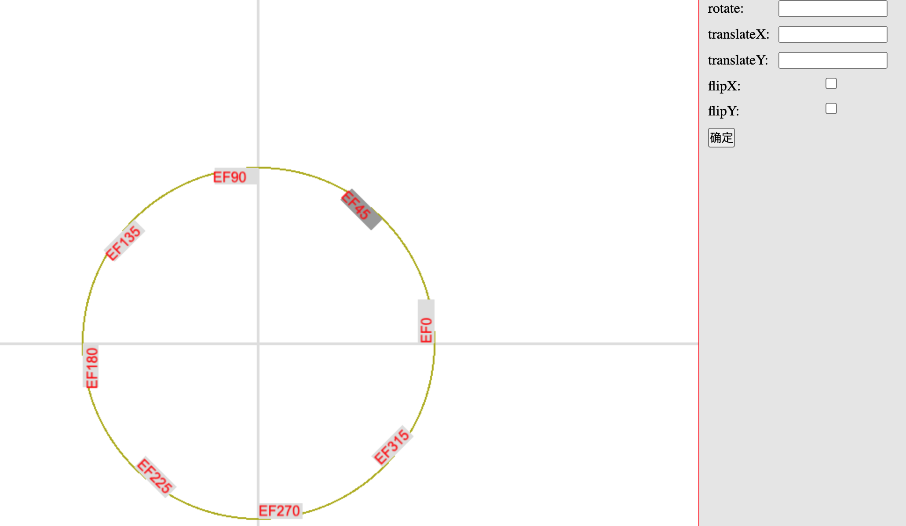

# pixi.js 中统一文本方向的 demo

pixi.js 中，文本显示存在以下问题:

- 在屏幕坐标系中, 文本方向是演 X 轴上下镜像的(flipX=true)
- 在此基础上, 文本仍有可能被再次镜像(flixX/flipY)
- 文本可能发生做生意角度的旋转, 比如旋转 180 度时, 需要反向旋转 180 度
- 文本沿 anchor 点存在 left/center/right 对齐关系
- 上述变换既可能发生在文本自身, 也可能发生在文本任意上级

此 demo 演示如何解决此问题

# 原理
如上图, 每个文本Text实际上包含3层: textWrapper > textBox > textDrawing\
真实项目中, Text.transform 直接应用在textWrapper中\
textDrawing用于调节 屏幕坐标系与pixi坐标系的 翻转\
而textBox用于校正(amend)镜像、旋转, 校正结果如上图\

第一步: 为每个text构造上述三层结构\
注意将textDrawing进行flipX操作\

第二步: 发生Transform(rotate/flip/translate)\
Transform可能发生在text.parent / text.anchor 上\
也可能是选中文本后Transform，此时绘制时，Transform将应用在textWrapper上\

第三步: 找到textWrapper相对于stage的全局matrix\
设textWrapper的全局matrix是 matrix0\

第四步: 推算校正后的全局matrix\
dempose(matrix0), 得到scaling.y, 如果 scaling.y<0，表示发生了镜像\
此时进行镜像校正，再重新读取matrix1\
decompose(matrix1) => rotation\
若rotation>90 && rotation<=270, 则需要加上PI(角度校正)\

第五步: 应用校正后的全局matrix\
校正后的全局matrix将应用到textBox上\
(不能修改textWrapper,也最好不要直接改textDrawing)
应用时需要转化为局部坐标

# 关于镜像
- flipX = flipY+rotate180
- flipY = flipX+rotate180
- flipXY = rotate180
所以, scaling.y<0表示某个方向发生了镜像, 不用关注水平还是竖直镜像
只要存在scaling.y<0, 就进行镜像校正

# TODO

[ ] 整理代码\
[ ] 提取并暴露 amendText 工具方法、getTextSize 方法\
[ ] getTextSize 改用 pixijs.getBounds 实现
